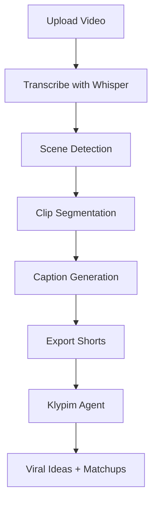

Absolutely, Kiwon! Here's a **fire README** for **Klypim**—your open-source AI video clipper—with **colorful Markdown**, **HTML flair**, and **emoji energy** to make creators feel **empowered, excited, and unstoppable** when they land on your repo:

---

```markdown
<div align="center">

<h1 style="color:#ff5c5c;">🔥 KLYPIM 🔥</h1>
<h3 style="color:#00bfff;">The Open-Source AI Video Clipper That Never Sleeps</h3>

https://img.shields.io/badge/Built%20With-Python-blue?style=flat-square
https://img.shields.io/badge/Powered%20By-Ollama-purple?style=flat-square
https://img.shields.io/badge/Scene%20Detection-PySceneDetect-orange?style=flat-square
https://img.shields.io/badge/Transcription-Whisper-green?style=flat-square
https://img.shields.io/badge/License-MIT-yellow?style=flat-square

</div>

---

## 🚀 What is Klypim?

**Klypim** is a free, open-source AI-powered tool that turns your long-form videos into **viral, captioned, vertical Shorts**—automatically. Upload once, and Klypim goes beast mode: transcribes, clips, captions, and even suggests 🔥 ideas to remix your content.

---

## ✨ Features That Slap

- 🎙️ **Transcribe** with Whisper (offline, fast, accurate)
- 🎬 **Scene Detect** with PySceneDetect
- ✂️ **Smart Clip Segmentation** (based on emotion, keywords, or silence)
- 💬 **Auto-Captions** with MoviePy + FFmpeg
- 📱 **Export Vertical Shorts** (9:16 format, ready for TikTok/YouTube)
- 🤖 **Klypim Agent** (powered by Ollama):
  - 🔥 Viral hooks & titles
  - 🎭 Smart match-ups across uploads
  - 🗣️ Voiceover generation
  - 💡 Remix & monetization ideas

---

## 🧠 Tech Stack

| Layer             | Tools Used              |
|------------------|--------------------------|
| Transcription     | Whisper                  |
| Scene Detection   | PySceneDetect            |
| Captioning        | MoviePy, FFmpeg          |
| Semantic Matching | SentenceTransformers     |
| LLM Agent         | Ollama                   |
| UI                | Streamlit                |
| Hosting           | Azure, Docker            |

---

## 🧱 Architecture Flow



---

## 💥 Why Klypim?

Because creators deserve tools that **work hard**, **think smart**, and **never charge upfront**. Klypim is built to empower you to **clip, remix, and dominate** the content game—whether you're a solo hustler or a media empire in the making.

---

## 🛠️ How to Run It

```bash
git clone https://github.com/yourusername/klypim
cd klypim
pip install -r requirements.txt
streamlit run frontend/streamlit_app.py
```

---

## 🧑‍🚀 Built by

**Kiwon Bowens** — Cinematographer, Computer Scientist, and Content Architect  
💡 Powered by creativity, zero budget, and infinite ambition.
